# Time in Umbraco Docker 🐋

## What is this repo?
An Umbraco 12 site, configured to launch into Linux Docker containers. The project can be run from Windows, Mac, or Linux machines. 

The project creates three containers, then installs Paul Seal's [Clean Starter Kit](https://our.umbraco.com/packages/starter-kits/clean-starter-kit/) with an unattended install:

- Frontend site
- Backoffice site
- MS-SQL database

## Credentials

Backoffice credentials:

- Username: Administrator
- Email: admin@example.com
- Password: One234567890@

## "The connection was reset"

When removing and recreating your Docker containers, you'll often see your localhost site throw an error like this for the first minute or so. This is normal, and just needs a little patience. We'll install a healthcheck, which will help you identify when the application is ready for connections. 

# Starting from scratch

## Prepare your project for Docker & Linux

Set your git repository to use Linux end of line configuration for `.sh` and `.cshtml` files. This is important because some scripts written in Windows will not run correctly on your Linux containers later. It's a huge hassle to identify this issue when it comes up. 

- Create a file `.gitignore` in the root of the solution directory
- Enter the following end or line instructions for Git

```bash
*.sh text eol=lf
*.cshtml text eol=lf
```

To verify and adjust this setting on individual files:

- Open the file in VSCode
- At the bottom right, check for either `CRLF` or `LF`, which indicates the file line endings mode
- If set to `CRLF`, update to `LF`

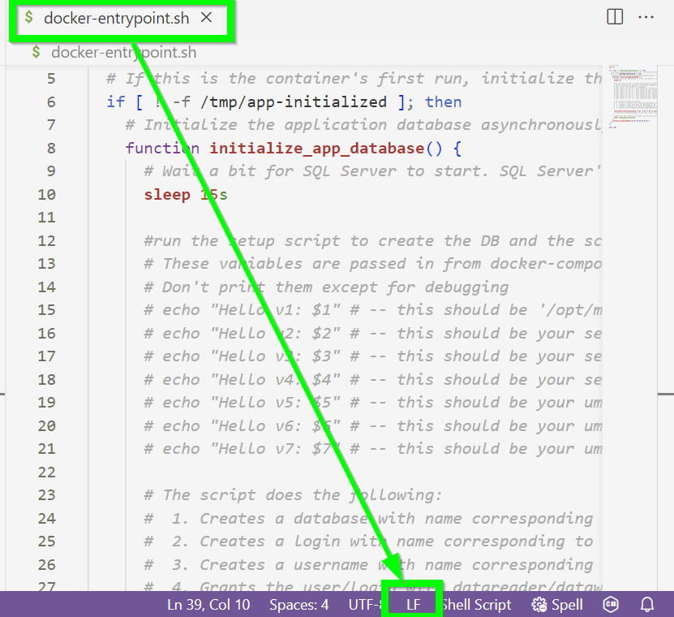


## Install Umbraco with the *Clean* package

In VSCode, install Umbraco using [Paul Seal's guide for Clean](https://github.com/prjseal/Clean-Starter-Kit-for-Umbraco-v9)

```bash
# Ensure the latest umbraco templates are installed
dotnet new -i Umbraco.Templates

# Create the solution and project
dotnet new sln --name "UmbracoDocker"
dotnet new umbraco -n "UmbracoDockerProject" --friendly-name "Administrator" --email "admin@example.com" --password "One234567890@" --development-database-type SQLite
dotnet sln add "UmbracoDockerProject"

# add the Clean starter kit
dotnet add "UmbracoDockerProject" package clean

# Run the project
dotnet run --project "UmbracoDockerProject"
```
You should now have an Umbraco v12 site running in the browser:

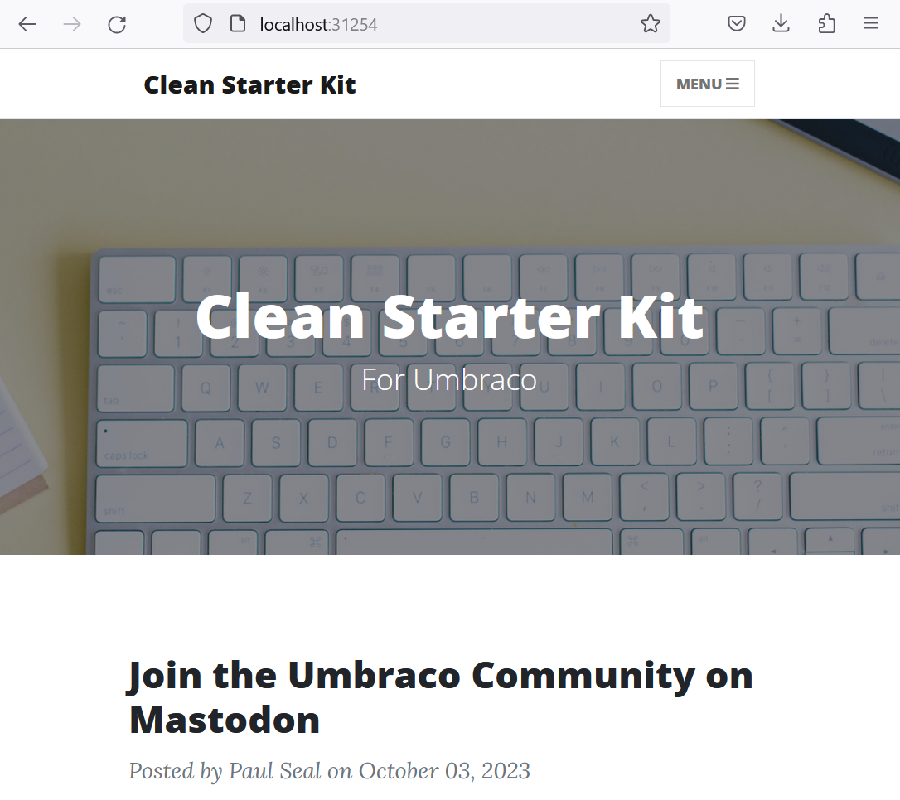

## Install Docker Desktop

- Visit https://www.docker.com/products/docker-desktop/
- Download and install the application, you don't need to create a Docker account
- Launch the application

You should now have Docker Desktop, along with all of its dependencies. Open VSCode's terminal and enter 

`docker -v`

and 

`docker-compose -v`

to check both are installed


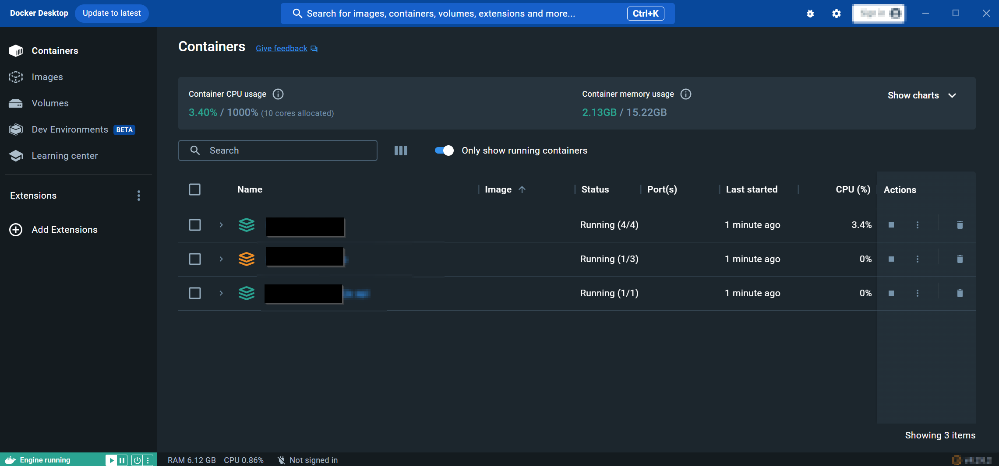


# Create Docker and environment files
We need a few docker files to get the project up and running, and a `.env` file. With the exception of `.dockerignore`, these all go in the solution level folder, not inside of the Umbraco project.

- .`env` Contains your environment variables. At runtime, these override any settings in your dotnet appsettings.json files
- `docker-compose.yml` a configuration file for Docker's compose feature. This makes it easier to manage projects that contain multiple containers
- `docker-entrypoint.sh` a shell script to execute when the docker container starts up. We'll use this to install our database
- `docker-setup.sql` a sql script to be executed by `docker-entrypoint.sh`
- `dockerfile.mssql` an instruction set for Docker to build the mssql server
- `dockerfile.umbracosite` an instruction set for Docker to build the Umbraco applications
- `./UmbracoDockerProject/.dockerignore` a list of files you'd like to exclude from docker's build processes. *Note that this file goes into your Umbraco project, not at the solution level*

## `.env`
This file contains environment variables & config settings for your containerised applications. Don't ever commit this file to your git repositories. In the repository, it's saved under `.env.example`, copy the contents into `.env`, then change the variables to match your project


### The file
```bash
PROJECT_FRIENDLY_NAME='UMBRACO_DOCKER_PROJECT'

UMBRACO_DATABASE_SERVER_SA_USERNAME='sa'
UMBRACO_DATABASE_SERVER_SA_PASSWORD='YOUR_PASS_goes_HERE@'

UMBRACO_DATABASE_USERNAME_STRING='EXAMPLE_DATABASE_LOGIN_NAME'
UMBRACO_DATABASE_PASSWORD_STRING='EXAMPLE_DATABASE_LOGIN_P@ssword'

UMBRACO_DATABASE_SERVER_AND_CONTAINER_NAME='example_umbraco_sql_server_db'
UMBRACO_DATABASE_NAME='EXAMPLE_UMBRACO_DATABASE_NAME'

UMBRACO_CMS_UNATTENDED_INSTALLUNATTENDED=true
UMBRACO_CMS_UNATTENDED_UNATTENDED_USERNAME='example username'
UMBRACO_CMS_UNATTENDED_UNATTENDED_EMAIL='example@email.com'
UMBRACO_CMS_UNATTENDED_UNATTENDED_PASSWORD='TEST12345@'
```

### What's the file doing?
Declares environment variables:

- `PROJECT_FRIENDLY_NAME` a friendly name for your project. Should be discrete per Docker project
- `UMBRACO_DATABASE_SERVER_SA_USERNAME` the Super Admin user for your SQL database
- `UMBRACO_DATABASE_SERVER_SA_PASSWORD` the Super Admin user's password

- `UMBRACO_DATABASE_USERNAME_STRING` the username for your Umbraco database user
- `UMBRACO_DATABASE_PASSWORD_STRING` the password for your Umbraco database user

- `UMBRACO_DATABASE_SERVER_AND_CONTAINER_NAME` the human readable name for your SQL Server in Docker
- `UMBRACO_DATABASE_NAME` the name of your database

- `UMBRACO_CMS_UNATTENDED_INSTALLUNATTENDED` toggle to turn unattended installations on and off
- `UMBRACO_CMS_UNATTENDED_UNATTENDED_USERNAME` unattended installation username
- `UMBRACO_CMS_UNATTENDED_UNATTENDED_EMAIL` unattended installation email
- `UMBRACO_CMS_UNATTENDED_UNATTENDED_PASSWORD` unattended installation password

These settings will be used by the rest of this guide. It's important to adjust them to your application's requirements. 

# Containerise your Umbraco site

## `UmbracoDockerProject/.dockerignore`

Create a file `.dockerignore` in your Umbraco project directory (the directory with the .csproj file, as opposed to the one with the .sln file)

### The file

```bash
**/bin/
**/obj/
```

### What's the file doing?

This tells Docker to ignore the `bin` and `obj` directories when building your images. This ensures you don't accidentally include locally built assemblies in your docker images.

## `dockerfile.umbracosite`

For simple projects, a dockerfile will just be named `dockerfile`. In this project, as we have multiple different docker images, they've each got an identifier as a suffix.

### The file

```dockerfile
# syntax=docker/dockerfile:1

FROM mcr.microsoft.com/dotnet/sdk:7.0 as build-env 

# Build Stage
WORKDIR /src
COPY ["UmbracoDockerProject/UmbracoDockerProject.csproj", "."]
RUN dotnet restore
COPY . .
RUN dotnet publish UmbracoDocker.sln --configuration Release --output /publish

# Runtime stage
FROM mcr.microsoft.com/dotnet/sdk:7.0 as runtime-env
WORKDIR /publish
COPY --from=build-env /publish .
ENV ASPNETCORE_URLS "http://+:80"
EXPOSE 80
ENTRYPOINT [ "dotnet", "UmbracoDockerProject.dll"]
```

### What's the file doing?
- Build stage:
  - Pulls down the base image of dotnet 7.0
  - Copies the `UmbracoDocker/UmbracoDockerProject.csproj"` csproj into the image
  - Installs all of its dependencies
  - Builds the site in Release configuration
  - Publishes the built application to `/publish` 
- Runtime stage:
  - Pulls down the base image of dotnet 7.0
  - Sets the working directory to `/publish`
  - Copies the content from the build stage into the runtime working directory
  - Exposes port 80 to allow internet access
  - Sets the entrypoint for the application to the Umbraco site's DLL

Once you've created this script, you should be able to run `docker build ./ -t umbraco-in-docker -f dockerfile.umbracosite` to build the image. The first time you run this script, it'll take a long time, as it needs to pull down a lot of dependencies. 

Once it's complete, you should be able to open Docker Desktop, click on *Images*, and see an image named `umbraco-in-docker`:

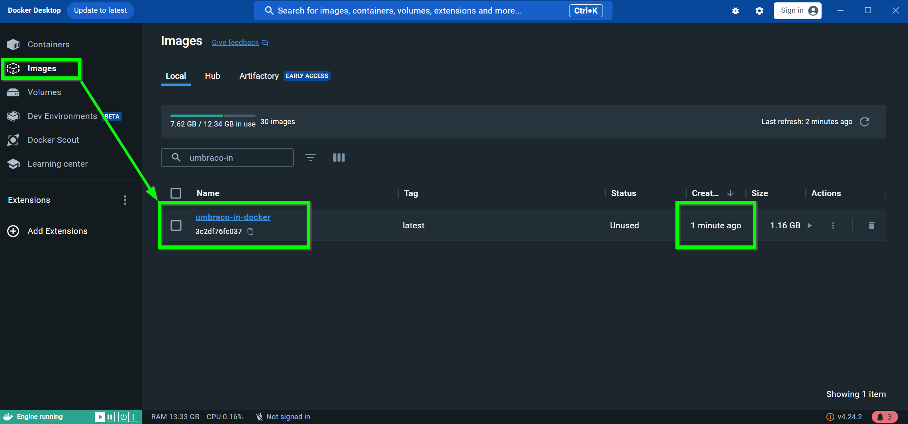


## `docker-compose.yml`
Now that we've got an image, we can create and launch a container using *Docker Compose*. Create the following `docker-compose.yml` file in the soltion directory.

### The file

```yml
version: '3'

services: 
  umbraco_website:
    build:
      context: .
      dockerfile: dockerfile.umbracosite
    restart: always
    ports:
      - 5011:80
    volumes:
      - umbraco_media:/publish/wwwroot/media
volumes: 
  umbraco_media: 
    external: false
```

### What's the file doing?

- The `services` node defines a named `umbraco_website`
- sets the context (location) of the service to the current directory `.`
- sets the dockerfile for the service to `dockerfile.umbracosite`  
- ensures the service restarts any time is stops or encounters an erorr
- sets the ports for the application to be exposed on. Note that if the port is in use by another application on the host computer, you'll receive an error like `Bind for 0.0.0.0:5011 failed: port is already allocated`
- Configures the directory `/publish/wwwroot/media` inside of the container to use a docker volume named `umbraco_media`
- Sets up a volume for `umbraco_media`

### Running `docker-compose` commands

Run the command `docker-compose up`. This will successfully launch an Umbraco site with the message **Boot Failed**... But at least we know the code runs.  

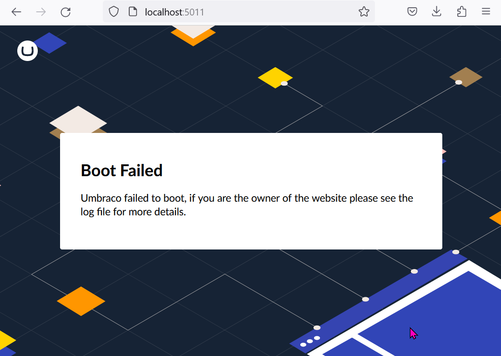

Docker Desktop should now have an entry in its *Containers* section named `time-in-umbraco-docker`, with a website `umbraco_website-1`.

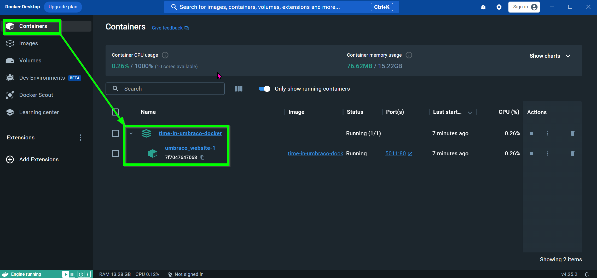

You'll also have a volume named `time-in-umbraco-docker_umbraco-media`.

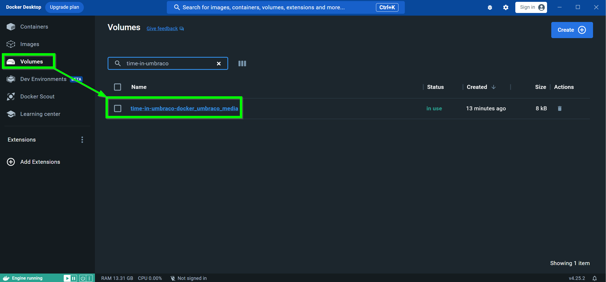


### Undoing `docker-compose` commands

*Note* that you can reverse the `docker-compose up` command at any time by running:

- `docker-compose down --rmi local --volumes` to remove all docker artifacts, and data volumes
- `docker-compose down --rmi local` to remove all docker artifacts, but leave data 

This will remove any docker-compose generated components (including your media and data). It's a good idea to clear down the data & volumes while debugging your Docker setup.


### Why isn't the site running?

We can inspect the log files to find out why the site isn't running. In docker desktop, select *Containers*, then select *Umbraco_Website-1*, click *Files*, then scroll down the list to the application directory `./publish/umbraco/Logs/UmbracoTraceLog.[datetime].json`. Right click the file and select *Edit* to quickly inspect the file. 

Reading through the logs, there's no database configured for the site!

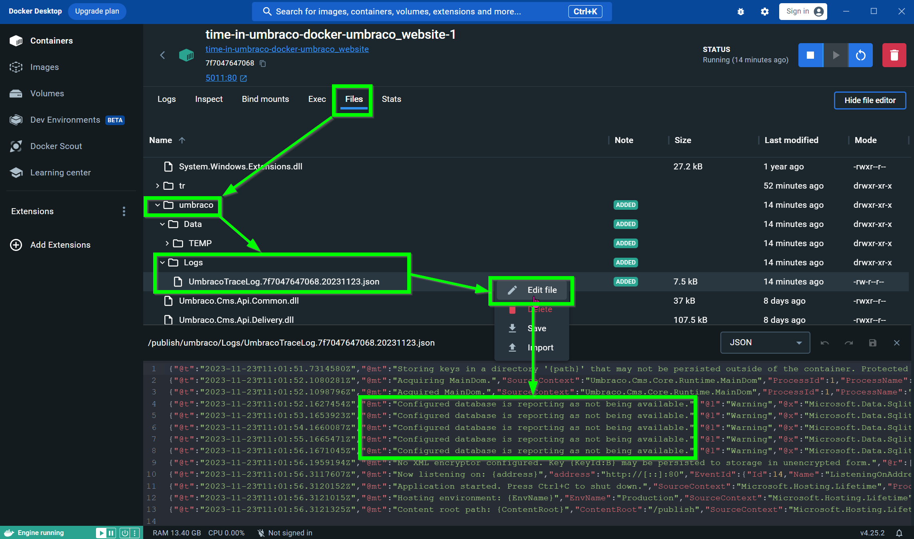


# Containerise your MSSQL database
Containerisng the MSSQL server is a bit more involved than the Umbraco applicaiton was, and will require a few files. 


## dockerfile.mssql
Similar to the `dockerfile.umbracosite` file, we need to tell Docker how to create the MSSQL server image

### The file

```dockerfile
FROM mcr.microsoft.com/mssql/server:2022-latest

USER root

RUN mkdir -p /var/opt/sqlserver

RUN chown mssql /var/opt/sqlserver

EXPOSE 1433/tcp

COPY docker-setup.sql /
COPY docker-entrypoint.sh /

RUN chmod +x /docker-entrypoint.sh

# entrypoint & cmd are set by the docker compose file
ENTRYPOINT [ ]
CMD [ ]

```

### What's the file doing?

- Specify the base image to use. Currently configured to use 2022-latest, but you may have different requirements or licenses with Micrsoft. Adjust this setting appropriately. 
- Temporarily switch the user to root so that we can create the required SQL Server directories
- Creates the `/var/opt/sqlserver` directory and sets `mssql` as an owner of the directory
- Exposes the server over port `1433`
- Copies two files to the image `docker-setup.sql` and `docker-entrypoint.sh` (these are created in the next steps)
- makes `docker-entrypoint.sh` an executable file
- configures empty entrypoints & command instructions. We'll configure these in `docker-compose.yml` soon


Create empty files named `docker-entrypoint.sh` and `docker-setup.sql`. You should now be able to run `docker build ./ -t umbraco-in-docker-mssql-server -f dockerfile.mssql`, after which, your Docker Desktop's list of images will include `umbraco-in-docker-mssql-server`.


## `docker-entrypoint.sh`

This shell script is executed by Docker whenever the mssql server starts up. It's configured in the `docker-compose.yml` file. It's modified from Carl Sargunar's [Umbraco Docker Workshop scripts](https://github.com/CarlSargunar/Umbraco-Docker-Workshop/blob/main/Workshop%20Complete/UmbData/startup.sh)

Make sure the file `docker-entrypoint.sh` is set to `LF` line endings

### The file
```shell
#!/bin/bash
set -e

if [ "$1" = '/opt/mssql/bin/sqlservr' ]; then
  # If this is the container's first run, initialize the application database
  if [ ! -f /tmp/app-initialized ]; then
    # Initialize the application database asynchronously in a background process. This allows a) the SQL Server process to be the main process in the container, which allows graceful shutdown and other goodies, and b) us to only start the SQL Server process once, as opposed to starting, stopping, then starting it again.
    function initialize_app_database() {
      # Wait a bit for SQL Server to start. SQL Server's process doesn't provide a clever way to check if it's up or not, and it needs to be up before we can import the application database
      sleep 15s

      #run the setup script to create the DB and the schema in the DB
      # These variables are passed in from docker-compose.yml, via dockerfile.mssql
      /opt/mssql-tools/bin/sqlcmd -S $2 -U $3 -P $4 -d master -i docker-setup.sql -v UMBRACO_DB_NAME="$5" UMBRACO_DB_USER_LOGIN="$6" UMBRACO_DB_USER_PASSWORD="$7" UMBRACO_DB_USER_NAME="$6_USER"
      # /opt/mssql-tools/bin/sqlcmd -S $2 -U $3 -P $4 -d master -i docker-setup.sql

      # Note that the container has been initialized so future starts won't wipe changes to the data
      touch /tmp/app-initialized
    }
    initialize_app_database $1 $2 $3 $4 $5 $6 $7 &
  fi
fi

exec "$@"
```

### What's the file doing?

- Declares itself as a shell script
- Sets the script to exit if there are any errors
- Checks the first argument passed to it is `'/opt/mssql/bin/sqlservr'` to verify we're running the correct shell script
- Inspects the `/tmp/app-initialized` file to see if this is the container's first run. If so, runs through the setup script
- runs the script `docker-setup.sql` with the arguments passed into the script
- marks the container as initialised, by touching `/tmp/app-initialized`


## `docker-setup.sql`

The `docker-entrypoint.sh` file executes this file the first time a container is run. It accepts some arguments, creates a database, and assigns a SQL user to it. It's modified from Carl Sargunar's [Umbraco Docker Workshop scripts](https://github.com/CarlSargunar/Umbraco-Docker-Workshop/blob/main/Workshop%20Complete/UmbData/setup.sql)


### The file
```sql
IF NOT EXISTS(SELECT * FROM sys.databases WHERE name = '$(UMBRACO_DB_NAME)')
    BEGIN
        CREATE DATABASE [$(UMBRACO_DB_NAME)]
    END

CREATE LOGIN $(UMBRACO_DB_USER_LOGIN)   
    WITH PASSWORD = '$(UMBRACO_DB_USER_PASSWORD)';  
GO  

-- Creates a database user for the login created above.  
USE [$(UMBRACO_DB_NAME)]
    CREATE USER $(UMBRACO_DB_USER_NAME) FOR LOGIN $(UMBRACO_DB_USER_LOGIN);  
GO  

USE [$(UMBRACO_DB_NAME)]
    ALTER ROLE db_datareader ADD MEMBER $(UMBRACO_DB_USER_NAME)
GO  

USE [$(UMBRACO_DB_NAME)]    
    ALTER ROLE db_datawriter ADD MEMBER $(UMBRACO_DB_USER_NAME)
GO  

USE [$(UMBRACO_DB_NAME)]
    ALTER ROLE db_ddladmin ADD MEMBER $(UMBRACO_DB_USER_NAME)
GO
```

### What's the file doing?
Accepts the following arguments from the `docker-compose.yml` file:
- `UMBRACO_DB_NAME` - the name of the Umbraco database
- `UMBRACO_DB_USER_LOGIN` - the DB User's login
- `UMBRACO_DB_USER_PASSWORD` - the DB User's password
- `UMBRACO_DB_USER_NAME` - the DB User's username

- Check if the database `$UMBRACO_DB_NAME` exists, and creates a new one if not
- Creates a login for `$UMBRACO_DB_USER_LOGIN` with the password `$UMBRACO_DB_USER_PASSWORD`
- Creates a database user `$(UMBRACO_DB_USER_NAME)`
- Switches into the Umbraco database, and sets the following user roles to ` $(UMBRACO_DB_USER_NAME)`
  - `db_datareader`
  - `db_datawriter`
  - `db_ddladmin`

These account roles match the current [Database Account Roles](https://docs.umbraco.com/umbraco-cms/fundamentals/setup/requirements#database-account-roles) documentation, but may need adjusting in the future. 

## Create a Volume for your SQL data

All data in a Docker container is destroyed between releases. That's not great for SQL servers, so next we need to create some persistent storage on the machine for our SQL data. This will survive server restarts & docker teardowns.

Run the command `docker volume create umbraco_docker_project_mssql_data` to create the volume

## Mac Users: Docker MSSQL Server on Apple Silicon

If you're using a first generation Apple Silicon Mac (likely the case if your Apple computer was manufactured in late 2020 or 2021), you will need to configure Rosetta Emulation to get MSSQL server running:

- Open docker desktop
- Click the Settings cog in the top right
- In the *General* tab, make sure *Use virtualization framework* is set to `true`
- Click *Features in Development*
- Set *Use Rosetta for x86/amd64 emulation on Apple Silicon* to `true`

## Adjust the `docker-compose.yml` file

Now that we've got a SQL server image, and all of its startup scripts, we'll need to include it in the `docker-compose.yml` file. 


### The file
```yml
version: '3'

services: 
  umbraco_website:
    build:
      context: .
      dockerfile: dockerfile.umbracosite
    restart: always
    ports:
      - 5011:80
    volumes:
      - umbraco_media:/publish/wwwroot/media
    depends_on:
      sql_server_db:
        condition: service_healthy
    environment:
      ConnectionStrings__umbracoDbDSN: "Server=${UMBRACO_DATABASE_SERVER_AND_CONTAINER_NAME},1433;Database=${UMBRACO_DATABASE_NAME};User Id=${UMBRACO_DATABASE_USERNAME_STRING};Password=${UMBRACO_DATABASE_PASSWORD_STRING};TrustServerCertificate=true;"
      ConnectionStrings__umbracoDbDSN_ProviderName: "System.Data.SqlClient"
    networks:
      - umbraco_application_mssql_network
  sql_server_db:
    build:
      context: .
      dockerfile: dockerfile.mssql
    entrypoint: [
      "/bin/bash", 
      "docker-entrypoint.sh"
    ]
    command: [ 
      "/opt/mssql/bin/sqlservr",  
      "${UMBRACO_DATABASE_SERVER_AND_CONTAINER_NAME}", 
      "${UMBRACO_DATABASE_SERVER_SA_USERNAME}", 
      "${UMBRACO_DATABASE_SERVER_SA_PASSWORD}",
      "${UMBRACO_DATABASE_NAME}",
      "${UMBRACO_DATABASE_USERNAME_STRING}",
      "${UMBRACO_DATABASE_PASSWORD_STRING}"      
    ]
    container_name: ${UMBRACO_DATABASE_SERVER_AND_CONTAINER_NAME}
    image:  mcr.microsoft.com/mssql/server:2022-latest
    ports: 
      - "1433:1433"
    networks:
      - umbraco_application_mssql_network
    environment: 
      SA_PASSWORD: "${UMBRACO_DATABASE_SERVER_SA_PASSWORD}"
      MSSQL_SA_PASSWORD: "${UMBRACO_DATABASE_SERVER_SA_PASSWORD}"
      ACCEPT_EULA: "Y"
      MSSQL_PID: "Express"
      MSSQL_BACKUP_DIR: "/var/opt/mssql"
      MSSQL_DATA_DIR: "/var/opt/data"
      MSSQL_LOG_DIR: "/var/opt/log"
    volumes: 
     - umbraco_mssql_data:/var/opt/mssql
    healthcheck:
      # prevents the Umbraco site running before the database is created
      test: ["CMD-SHELL", "/opt/mssql-tools/bin/sqlcmd -S ${UMBRACO_DATABASE_SERVER_AND_CONTAINER_NAME} -d ${UMBRACO_DATABASE_NAME} -U ${UMBRACO_DATABASE_USERNAME_STRING} -P ${UMBRACO_DATABASE_PASSWORD_STRING} -Q 'SELECT 1' || exit 1"]      
      interval: 15s
      timeout: 30s
      retries: 5
      start_period: 20s
volumes: 
  umbraco_media: 
    external: false
  umbraco_mssql_data:
    external: false
networks:
  umbraco_application_mssql_network: 
    name: "${PROJECT_FRIENDLY_NAME}_umbraco_application_mssql_network"
```

### What's the file doing?
We've included the new MSSQL server DB, added a new network, and connected the Umbraco site to some configuration files. 

- A new `volume` is referenced for the MSSQL data
- A new network is added to allow the applications to communicate
- A new `sql_derver_db` node
  - Sets the context & builds the image according to `dockerfile.mssql`
  - Tells docker that the bash script `docker-entrypoint.sh` script should run when this container starts
  - Passes a set of arguments to `docker-entrypoint.sh` through the `command` node
  - sets a friendly name for the container image
  - Specifies the mssql image from Microsoft's container registry
  - Exposes the port 1433, allowing external connections to the server
  - Attaches the SQL server to the new `network` so that other containerised apps can communicate with it
  - Sets a series of environment variables, mostly from the `.env` file
    - `ACCEPT_EULA` instructs the SQL server to auto-accept the license agreement
    - `MSSQL_PID` instructs the SQL server to start in `Express` mode. Other options include `Developer` or `Enterprise`, note that Microsoft requires licenses for some of these options
    - Sets the backup, data, and log directories at `/var/opt/mssql`
  - Associates the volume we created earlier, configuring it to host `/var/opt/mssql`
  - Creates a healthcheck, which attempts to query the database with the Umbraco SQL user
- On the `umbraco_website` node
  - Added a new `depends_on` node, this checks if the SQL Server is successfully running before we launch the Umbraco site
  - Two new `environment` variables have been added to specify the UmbracoDbDSN and UmbracoDbDSN_ProviderName
  - A new `network` component has been added to connect the Umbraco application to the MSSQL server, without this node, the two isolated processes won't be able to talk to each other


The full list of environment variables you can pass to MSSQL Server in the `environment` node can be found in [MSDN's documentation](https://learn.microsoft.com/en-us/sql/linux/sql-server-linux-configure-environment-variables?view=sql-server-ver16).

Run `docker-compose down --rmi local --volumes` to remove the broken Umbraco site, then run `docker-compose up`. After a minute or so, your Docker Desktop will include two services, an Umbraco Website, and a SQL database:

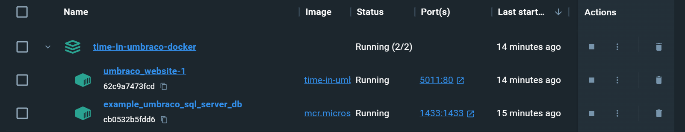

Visiting the port, we can see the Umbraco Installation page:

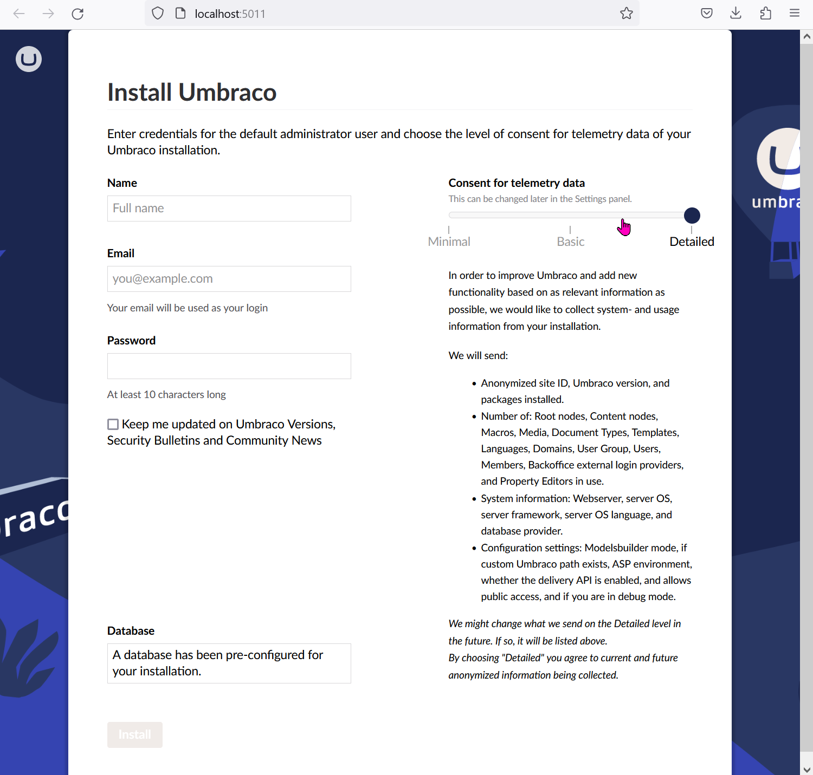

After filling out the form, we can see the Clean Starter Kit:

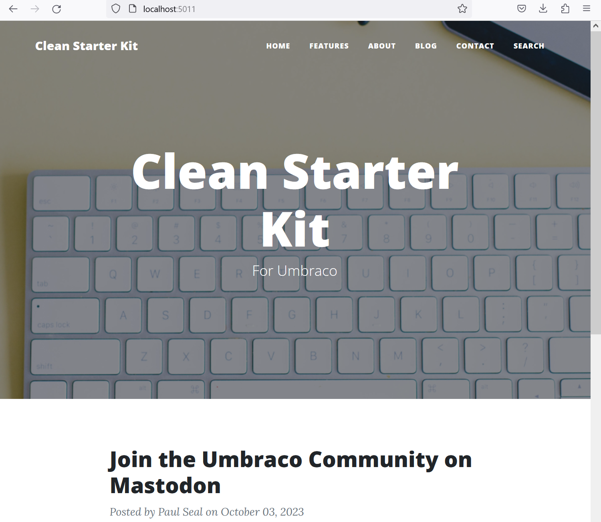

Umbraco's now configured to run in Docker! But we can do better. The following optional sections will configure automated installations, use usync to automatically copy data into the website, and connect an extra front-end server. 

## Connecting to your Docker MSSQL databases

You can connect to your Docker hosted SQL with MSSQL Server Studio from your desktop. To connect as the Umbraco Application user, enter the following properties (values are set in the `.env` file, the port is set in `docker-compose.yml`):

- Server Type: Database Engine
- Server name: `localhost,1433` 
- Authentication: `SQL Server Authentication`
- Login: `EXAMPLE_DATABASE_LOGIN_NAME`
- Password: `EXAMPLE_DATABASE_LOGIN_P@ssword`
- In the options tab >> 
  - Connect to database: `EXAMPLE_UMBRACO_DATABASE_NAME`


To connect as Admin, enter the following properties:

- Server Type: Database Engine
- Server name: `localhost,1433` 
- Authentication: `SQL Server Authentication`
- Login: `sa`
- Password: `YOUR_PASS_goes_HERE@`
- In the options tab >> 
  - Connect to database: `EXAMPLE_UMBRACO_DATABASE_NAME`

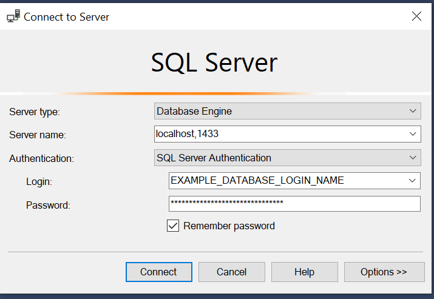

## Configure unattended installs

By adding a new node into `docker-compose.yml`, we can quickly add multi-instance support. 

### The file changes
In the `docker-compose.yml` file, update `umbraco_website`'s `environment` node to include the following properties

```yml
    environment:
      ConnectionStrings__umbracoDbDSN: "Server=${UMBRACO_DATABASE_SERVER_AND_CONTAINER_NAME},1433;Database=${UMBRACO_DATABASE_NAME};User Id=${UMBRACO_DATABASE_USERNAME_STRING};Password=${UMBRACO_DATABASE_PASSWORD_STRING};TrustServerCertificate=true;"
      ConnectionStrings__umbracoDbDSN_ProviderName: "System.Data.SqlClient"
      Umbraco__CMS__Unattended__InstallUnattended: ${UMBRACO_CMS_UNATTENDED_INSTALLUNATTENDED}
      Umbraco__CMS__Unattended__UnattendedUserName: '${UMBRACO_CMS_UNATTENDED_UNATTENDED_USERNAME}'
      Umbraco__CMS__Unattended__UnattendedUserEmail: '${UMBRACO_CMS_UNATTENDED_UNATTENDED_EMAIL}'
      Umbraco__CMS__Unattended__UnattendedUserPassword: '${UMBRACO_CMS_UNATTENDED_UNATTENDED_PASSWORD}'
```

### What's the change doing?
- Adds four new environment variables
  - Config to toggle unattended installs on and off
  - The Username, email, and password for your unattended install user

Run the following commands to drop your old application, and restart with unattended installs:

- (this step deletes all your data) Run `docker-compose down --rmi local --volumes` to remove your application from Docker 
- Run `docker-compose up` to relaunch the app

When your app relaunches, it should automatically install Umbraco, and instead of being presented with the Install screen, you'll be presented with the Clean Starter Kit.

## Add healthchecks to your site startup

We've configured a healthcheck for the SQL server already, we can add one for our web applications too. In the `docker-compose.yml` file, on the `umbraco_website` node, add the following node:


### The file changes
```yml
    healthcheck:
      test: curl --fail http://localhost:80 || exit 1
      interval: 30s
      timeout: 30s
      retries: 100
      start_period: 180s
```

### What's the change doing?

Adds an automatic healthcheck ot the site
- adds a `test` definition, a simple `curl` to the front-end just checks there's no `500` error
- Sets the interval to 30 seconds, and waits 180 seconds before launching 

After implementing this change, your Docker Desktop will wait until the test has passed before highlighting the application in green as "running"


## Split the Umbraco application into two, a frontend and backoffice

Now that our Umbraco application has a healthcheck, we can add new applications which depend on it - for example, a front-end. In the `docker-compose.yml`, make the following changes

### The file changes
**In the `umbraco_website` node**
- Update the node's name from `umbraco_website` to `umbraco_website_backoffice`
- Add a new node `container_name: '${PROJECT_FRIENDLY_NAME}_umbraco_backoffice'`
- Add a new volume property `umbraco_logs:/publish/umbraco/Logs` 

**In the `volume` node**
  - Add a new property:
```yml  
  umbraco_logs: 
    external: false
```

**Create a new node `umbraco_website_frontend`**


```yml
website_frontend_1:
    container_name: '${PROJECT_FRIENDLY_NAME}_umbraco_frontend_1'
    build:
      context: .
      dockerfile: dockerfile.umbracosite
    restart: always
    ports:
      - 5012:80
    volumes:
      - umbraco_media:/publish/wwwroot/media
      - umbraco_logs:/publish/umbraco/Logs
    depends_on:
      sql_server_db:
        # this condition forces the website to wait for the database to report "healthy" status 
        condition: service_healthy
        # this condition forces the front-end to wait for the backoffice to be "healthy" before starting
      umbraco_website_backoffice:
        condition: service_healthy
    environment:
      ConnectionStrings__umbracoDbDSN: "Server=${UMBRACO_DATABASE_SERVER_AND_CONTAINER_NAME},1433;Database=${UMBRACO_DATABASE_NAME};User Id=${UMBRACO_DATABASE_USERNAME_STRING};Password=${UMBRACO_DATABASE_PASSWORD_STRING};TrustServerCertificate=true;"
      ConnectionStrings__umbracoDbDSN_ProviderName: 'System.Data.SqlClient'
      Umbraco__CMS__Unattended__InstallUnattended: 'false'
    networks:
      - umbraco_application_mssql_network
    healthcheck:
      test: curl --fail http://localhost:80 || exit 1
      interval: 30s
      timeout: 30s
      retries: 100
      start_period: 180s
```

### What's the change doing?
We're replicating our backoffice instance into a new frontend instance. The key differences between the two configurations are:

- The container names are updated so we can see the difference between the two
- A shared `logs` volume has been created to track both front and backend logs in one location
- The front-end:
  - Attached to the mssql network
  - Has a different port `5012` to the backoffice, `5012` instead of `5011`
  - `Umbraco__CMS__Unattended__InstallUnattended` is set to false, so that the backoffice doesn't attempt to auto-install Umbraco

Once you've  launched the site using `docker-compose up`, you should be able to sign into the backoffice on localhost:5011/umbraco, make a change to the site, and then see that change in the front-end at localhost:5012

Note that, if you're attempting to replicate load-balancing, you'll still need to implement the documentation's [Load Balancing guidance](https://docs.umbraco.com/umbraco-cms/fundamentals/setup/server-setup/load-balancing). It's especially important to set your non-backoffice servers to be `Subscriber` servers, see more about [Server Roles in the official Umbraco documentation](https://docs.umbraco.com/umbraco-cms/fundamentals/setup/server-setup/load-balancing#automatic-server-role-election). 


## Use uSync to launch your application with content

Right now the app is launching with Paul Seal's Clean Starterkit content. What if we want to launch the site with some different default content? We can make use of [Kevin Jump & Jumoo's uSync](https://jumoo.co.uk/uSync/), and its auto-import features to launch a site full of test content. Install uSync, then update `docker-compose` with the following changes. 

### Installations, and edits

- Install the `Clean.Core` nuget package: https://www.nuget.org/packages/clean.core
- Uninstall the `Clean` nuget package: https://www.nuget.org/packages/clean
- Install the `uSync` nuget package: https://www.nuget.org/packages/usync


### The file changes

In the `umbraco_website_backoffice`'s `environment` node, add the following configurations to enable uSync. 

```yml
      uSync__Settings__ImportOnFirstBoot: 'true'
      uSync__Settings__ExportOnSave: 'false'
      uSync__Settings__FirstBootGroup: 'all'
      uSync__Sets__Default__HandlerDefaults__GuidNames: 'true'
```

In the `website_frontend_1`'s `environment` node, add the following configurations to disable uSync there. We don't want to run any of these features on the front-ends.

```yml
      uSync__Settings__ImportAtStartup: 'false'
      uSync__Settings__ImportOnFirstBoot: 'false'
      uSync__Settings__ExportOnSave: 'false'
      uSync__Settings__ExportOnStartup: 'false'
      uSync__Settings__DisableDashboard: 'true'
      uSync__Settings__SummaryDashboard: 'true'
```

When you clear down and launch the site, you should now see a Clean Starter Kit website including content about Whales.

## Quickly test if your app runs on dotnet v8.0

One advantage of containerisation is that it allows you to very quickly see issues you'll have if you're moving frameworks, or underlying technologies in your stack. dotnet-v8 was released recently, and we can check if the app runs by following these simple steps:

- Open `dockerfile.umbracosite` and edit `sdk:7.0` to `sdk:8.0`
- (this step deletes all your data) Run `docker-compose down --rmi local --volumes` to remove your application from Docker 
- Run `docker-compose up` to launch a testable version of your app 

Unsurprisingly, the app doesn't run first time, but we can see production-level exceptions and start to debug those.

---


